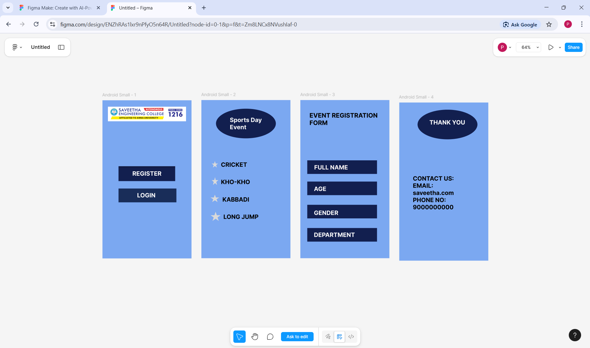

# Ex09 Event Registration Web Application
## Date:09-11-2025

## AIM:
To design, develop and deploy a web application for event registration.

## DESIGN STEPS:

### Step 1:
Create a new frame.

### Step 2:
Select any one preset size of your choice.

### Step 3:
Select the shapes you need.

### Step 4:
Import images as needed.

### Step 5:
Create pages based on your need and link them.

### Step 6:

Validate the HTML and CSS code.

### Step 6:

Publish the website in the given URL.

## DESIGN TOOL:
Figma

## CODE:
```
<!DOCTYPE html>
<html>
<head>
  <meta charset="UTF-8">
  <meta name="viewport" content="width=device-width, initial-scale=1.0">
  <title>Exported Figma Design</title>
  <link href="https://fonts.googleapis.com/css?family=Inter&display=swap" rel="stylesheet">

  <link rel="stylesheet" href="styles.css">
</head>
<body>
<div class="iphone-16-pro-1-1">
<div class="rectangle-2"></div>
<p class="text-3"><span class="text-black">REGISTER</span></p>
<div class="rectangle-1-4"></div>
<p class="text-5"><span class="text-black">LOGIN
</span></p>
</div>

</body>
</html>
CSS
:root {
  --font-family-inter: 'Inter', sans-serif;
  --text-black: rgba(0, 0, 0, 1);
}

.text-black {
  color: var(--text-black);
}


/* CSS Reset */
* {
  margin: 0;
  padding: 0;
  box-sizing: border-box;
}

body {
  width: 100%;
  min-height: 100vh;
  overflow-x: hidden;
}

img {
  max-width: 100%;
  height: auto;
}

.rectangle-2 {
  flex-grow: 0;
  flex-shrink: 1;
  flex-basis: auto;
  box-shadow: 0px 4px 4px 0px rgba(0,0,0,0.5);
  background-color: rgba(156, 230, 241, 1);
}

.text-3 {
  flex-grow: 0;
  flex-shrink: 1;
  flex-basis: auto;
  font-family: var(--font-family-inter);
  font-weight: 700;
  font-size: 32px;
  text-decoration: none;
  text-transform: none;
  color: var(--text-black);
}

.rectangle-1-4 {
  flex-grow: 0;
  flex-shrink: 1;
  flex-basis: auto;
  background-color: rgba(156, 230, 241, 1);
}

.text-5 {
  flex-grow: 0;
  flex-shrink: 1;
  flex-basis: auto;
  font-family: var(--font-family-inter);
  font-weight: 700;
  font-size: 32px;
  text-decoration: none;
  text-transform: none;
  color: var(--text-black);
}

.iphone-16-pro-1-1 {
@media (max-width: 1440px) {
  .iphone-16-pro-1-1 {
    padding-left: 24px;
    padding-right: 24px;
  }
}

@media (max-width: 768px) {
  .iphone-16-pro-1-1 {
    padding-left: 16px;
    padding-right: 16px;
  }
}
  flex-grow: 0;
  flex-shrink: 1;
  flex-basis: auto;
  background-color: rgba(197, 159, 193, 1);
}
<!DOCTYPE html>
<html>
<head>
  <meta charset="UTF-8">
  <meta name="viewport" content="width=device-width, initial-scale=1.0">
  <title>Exported Figma Design</title>
  <link href="https://fonts.googleapis.com/css?family=Inter&display=swap" rel="stylesheet">

  <link rel="stylesheet" href="styles.css">
</head>
<body>
<div class="iphone-16-1-1">

<p class="text-3"><span class="text-black">Sports Day                  
Event
</span></p>

<p class="text-5"><span class="text-black">KHO-KHO</span></p>

<p class="text-7"><span class="text-black">KABBADI</span></p>

<p class="text-9"><span class="text-black">CRICKET</span></p>

<p class="text-11"><span class="text-black">LONG JUMP</span></p>

<p class="text-13"><span class="text-black">BADMINTON</span></p>
</div>

</body>
</html>
CSS
:root {
  --font-family-inter: 'Inter', sans-serif;
  --text-black: rgba(0, 0, 0, 1);
}

.text-black {
  color: var(--text-black);
}


/* CSS Reset */
* {
  margin: 0;
  padding: 0;
  box-sizing: border-box;
}

body {
  width: 100%;
  min-height: 100vh;
  overflow-x: hidden;
}

img {
  max-width: 100%;
  height: auto;
}

.ellipse-1-2 {
  flex-grow: 0;
  flex-shrink: 1;
  flex-basis: auto;
  fill: rgba(217, 217, 217, 1);
  border: none;
  outline: none;
}

.text-3 {
  flex-grow: 0;
  flex-shrink: 1;
  flex-basis: auto;
  font-family: var(--font-family-inter);
  font-weight: 700;
  font-size: 32px;
  text-decoration: none;
  text-transform: none;
  color: var(--text-black);
}

.star-1-4 {
  flex-grow: 0;
  flex-shrink: 1;
  flex-basis: auto;
  fill: rgba(217, 217, 217, 1);
  border: none;
  outline: none;
}

.text-5 {
  flex-grow: 0;
  flex-shrink: 1;
  flex-basis: auto;
  font-family: var(--font-family-inter);
  font-weight: 700;
  font-size: 32px;
  text-decoration: none;
  text-transform: none;
  color: var(--text-black);
}

.star-2-6 {
  flex-grow: 0;
  flex-shrink: 1;
  flex-basis: auto;
  fill: rgba(217, 217, 217, 1);
  border: none;
  outline: none;
}

.text-7 {
  flex-grow: 0;
  flex-shrink: 1;
  flex-basis: auto;
  font-family: var(--font-family-inter);
  font-weight: 700;
  font-size: 32px;
  text-decoration: none;
  text-transform: none;
  color: var(--text-black);
}

.star-3-8 {
  flex-grow: 0;
  flex-shrink: 1;
  flex-basis: auto;
  fill: rgba(217, 217, 217, 1);
  border: none;
  outline: none;
}

.text-9 {
  flex-grow: 0;
  flex-shrink: 1;
  flex-basis: auto;
  font-family: var(--font-family-inter);
  font-weight: 700;
  font-size: 32px;
  text-decoration: none;
  text-transform: none;
  color: var(--text-black);
}

.star-4-10 {
  flex-grow: 0;
  flex-shrink: 1;
  flex-basis: auto;
  fill: rgba(217, 217, 217, 1);
  border: none;
  outline: none;
}

.text-11 {
  flex-grow: 0;
  flex-shrink: 1;
  flex-basis: auto;
  font-family: var(--font-family-inter);
  font-weight: 700;
  font-size: 32px;
  text-decoration: none;
  text-transform: none;
  color: var(--text-black);
}

.star-5-12 {
  flex-grow: 0;
  flex-shrink: 1;
  flex-basis: auto;
  fill: rgba(217, 217, 217, 1);
  border: none;
  outline: none;
}

.text-13 {
  flex-grow: 0;
  flex-shrink: 1;
  flex-basis: auto;
  font-family: var(--font-family-inter);
  font-weight: 700;
  font-size: 32px;
  text-decoration: none;
  text-transform: none;
  color: var(--text-black);
}

.iphone-16-1-1 {
@media (max-width: 1440px) {
  .iphone-16-1-1 {
    padding-left: 24px;
    padding-right: 24px;
  }
}

@media (max-width: 768px) {
  .iphone-16-1-1 {
    padding-left: 16px;
    padding-right: 16px;
  }
}
  flex-grow: 0;
  flex-shrink: 1;
  flex-basis: auto;
  background-color: rgba(195, 156, 195, 1);
}
<!DOCTYPE html>
<html>
<head>
  <meta charset="UTF-8">
  <meta name="viewport" content="width=device-width, initial-scale=1.0">
  <title>Exported Figma Design</title>
  <link href="https://fonts.googleapis.com/css?family=Inter&display=swap" rel="stylesheet">

  <link rel="stylesheet" href="styles.css">
</head>
<body>
<div class="iphone-16-pro-2-1">
<p class="text-2"><span class="text-black">EVENT REGISTRATION              FORM</span></p>
<div class="rectangle-3-3"></div>
<p class="text-4"><span class="text-black">FULL NAME</span></p>
<div class="rectangle-4-5"></div>
<p class="text-6"><span class="text-black">AGE</span></p>
<div class="rectangle-7"></div>
<div class="rectangle-6-8"></div>
<p class="text-9"><span class="text-black">DEPARTMENT</span></p>
<p class="text-10"><span class="text-black">GENDER</span></p>
</div>

</body>
</html>
CSS
:root {
  --font-family-inter: 'Inter', sans-serif;
  --text-black: rgba(0, 0, 0, 1);
}

.text-black {
  color: var(--text-black);
}


/* CSS Reset */
* {
  margin: 0;
  padding: 0;
  box-sizing: border-box;
}

body {
  width: 100%;
  min-height: 100vh;
  overflow-x: hidden;
}

img {
  max-width: 100%;
  height: auto;
}

.text-2 {
  flex-grow: 0;
  flex-shrink: 1;
  flex-basis: auto;
  font-family: var(--font-family-inter);
  font-weight: 700;
  font-size: 32px;
  text-decoration: none;
  text-transform: none;
  color: var(--text-black);
}

.rectangle-3-3 {
  flex-grow: 0;
  flex-shrink: 1;
  flex-basis: auto;
  background-color: rgba(217, 217, 217, 1);
}

.text-4 {
  flex-grow: 0;
  flex-shrink: 1;
  flex-basis: auto;
  font-family: var(--font-family-inter);
  font-weight: 700;
  font-size: 24px;
  text-decoration: none;
  text-transform: none;
  color: var(--text-black);
}

.rectangle-4-5 {
  flex-grow: 0;
  flex-shrink: 1;
  flex-basis: auto;
  background-color: rgba(217, 217, 217, 1);
}

.text-6 {
  flex-grow: 0;
  flex-shrink: 1;
  flex-basis: auto;
  font-family: var(--font-family-inter);
  font-weight: 700;
  font-size: 24px;
  text-decoration: none;
  text-transform: none;
  color: var(--text-black);
}

.rectangle-7 {
  flex-grow: 0;
  flex-shrink: 1;
  flex-basis: auto;
  background-color: rgba(217, 217, 217, 1);
}

.rectangle-6-8 {
  flex-grow: 0;
  flex-shrink: 1;
  flex-basis: auto;
  background-color: rgba(217, 217, 217, 1);
}

.text-9 {
  flex-grow: 0;
  flex-shrink: 1;
  flex-basis: auto;
  font-family: var(--font-family-inter);
  font-weight: 700;
  font-size: 24px;
  text-decoration: none;
  text-transform: none;
  color: var(--text-black);
}

.text-10 {
  flex-grow: 0;
  flex-shrink: 1;
  flex-basis: auto;
  font-family: var(--font-family-inter);
  font-weight: 700;
  font-size: 24px;
  text-decoration: none;
  text-transform: none;
  color: var(--text-black);
}

.iphone-16-pro-2-1 {
@media (max-width: 1440px) {
  .iphone-16-pro-2-1 {
    padding-left: 24px;
    padding-right: 24px;
  }
}

@media (max-width: 768px) {
  .iphone-16-pro-2-1 {
    padding-left: 16px;
    padding-right: 16px;
  }
}
  flex-grow: 0;
  flex-shrink: 1;
  flex-basis: auto;
  background-color: rgba(191, 163, 200, 1);
}
<!DOCTYPE html>
<html>
<head>
  <meta charset="UTF-8">
  <meta name="viewport" content="width=device-width, initial-scale=1.0">
  <title>Exported Figma Design</title>
  <link href="https://fonts.googleapis.com/css?family=Inter&display=swap" rel="stylesheet">

  <link rel="stylesheet" href="styles.css">
</head>
<body>
<div class="iphone-16-pro-3-1">

<p class="text-3"><span class="text-black">THANK YOU</span></p>
<p class="text-4"><span class="text-black">contact us
E mail:
saveetha.com
phone no:
9876543210</span></p>
</div>

</body>
</html>
CSS
:root {
  --font-family-inter: 'Inter', sans-serif;
  --text-black: rgba(0, 0, 0, 1);
}

.text-black {
  color: var(--text-black);
}


/* CSS Reset */
* {
  margin: 0;
  padding: 0;
  box-sizing: border-box;
}

body {
  width: 100%;
  min-height: 100vh;
  overflow-x: hidden;
}

img {
  max-width: 100%;
  height: auto;
}

.ellipse-2-2 {
  flex-grow: 0;
  flex-shrink: 1;
  flex-basis: auto;
  fill: rgba(217, 217, 217, 1);
  border: none;
  outline: none;
}

.text-3 {
  flex-grow: 0;
  flex-shrink: 1;
  flex-basis: auto;
  font-family: var(--font-family-inter);
  font-weight: 700;
  font-size: 32px;
  text-decoration: none;
  text-transform: none;
  color: var(--text-black);
}

.text-4 {
  flex-grow: 0;
  flex-shrink: 1;
  flex-basis: auto;
  font-family: var(--font-family-inter);
  font-weight: 300;
  font-size: 32px;
  text-decoration: none;
  text-transform: none;
  color: var(--text-black);
}

.iphone-16-pro-3-1 {
@media (max-width: 1440px) {
  .iphone-16-pro-3-1 {
    padding-left: 24px;
    padding-right: 24px;
  }
}

@media (max-width: 768px) {
  .iphone-16-pro-3-1 {
    padding-left: 16px;
    padding-right: 16px;
  }
}
  flex-grow: 0;
  flex-shrink: 1;
  flex-basis: auto;
  background-color: rgba(209, 169, 210, 1);
}

```
## OUTPUT:



## RESULT:
The program to design, develop and deploy a web application for event registration is completed successfully.
